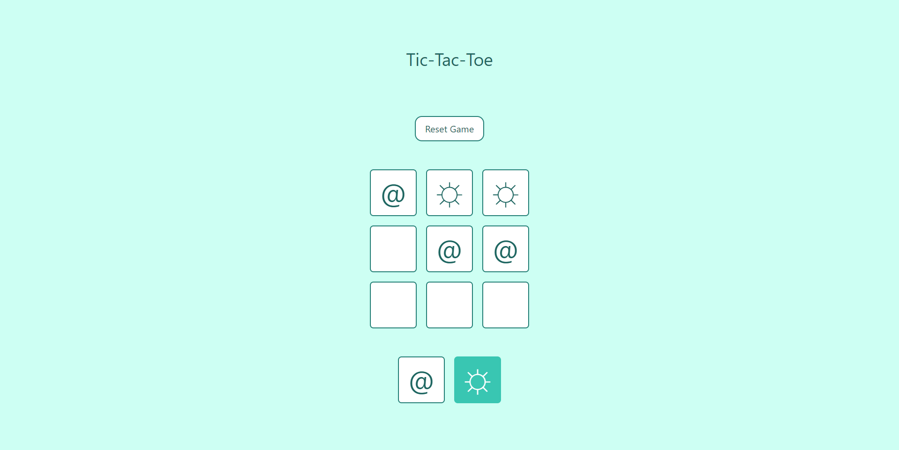

# Tic-Tac-Toe-Game - #miduChallenges

This project is a classic Tic Tac Toe game, fully functional and interactive. It utilizes technologies such as React and Tailwind CSS to create a clean and elegant user interface.

## Technologies Used

- HTML
- CSS
- JavaScript
- React.js
- Tailwind CSS

## Demo

You can see a demonstration of the application in action [Tic-Tac-Toe](https://ibrahim-003.github.io/twitter-card/)

## Capturas de Pantalla

